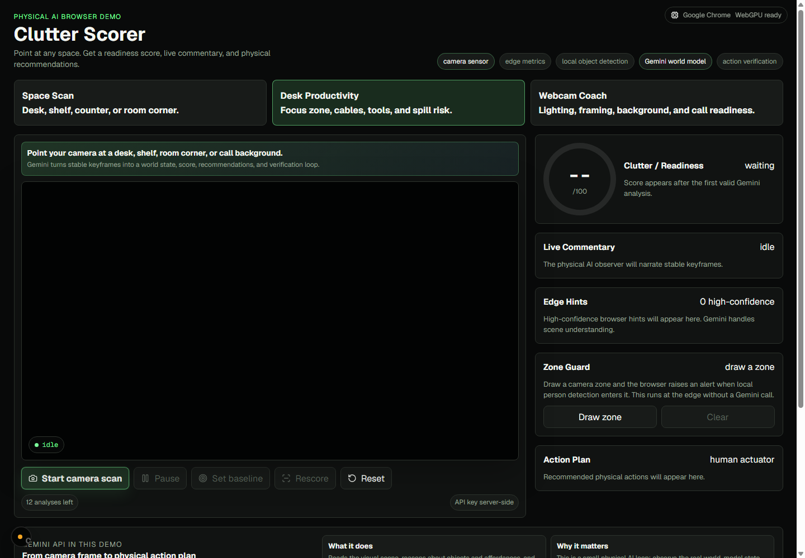
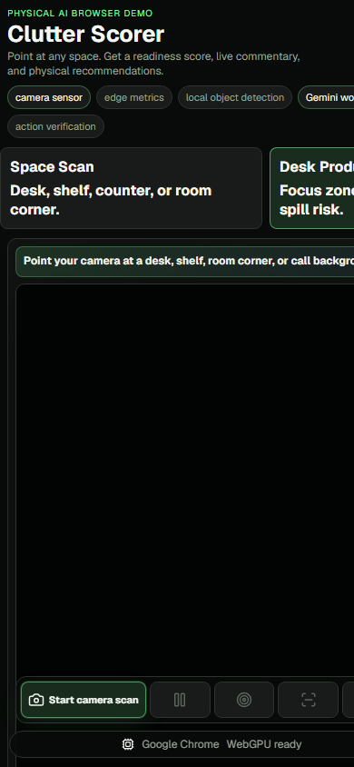

# Clutter Scorer

Clutter Scorer is a browser-native physical AI and robotics perception demo for everyday spaces.

It treats a webcam or phone camera like a lightweight robot sensor: the browser runs local perception, Gemini builds a scene-level world model, and the user acts as the robot actuator. The result is a live loop that observes a physical environment, reasons about objects and affordances, recommends actions, and verifies whether the scene improved.

The product loop is:

```text
Observe -> Detect -> Model -> Plan -> Verify
```

The demo is intentionally grounded in robotics language: sensor input, edge perception, world-state estimation, affordance reasoning, action planning, and closed-loop verification.

## Screenshots





## Demo Modes

- **Space Scan**: desks, shelves, counters, and room corners.
- **Desk Productivity**: focus zone, cables, tools, spill risk, and work readiness.
- **Webcam Coach**: lighting, framing, background clarity, visible clutter, and call readiness.
- **Zone Guard**: manually draw a camera zone and trigger a browser-side alert when local person detection enters it.

## Technical Flow

1. Open the app in Chrome or Edge.
2. Start the camera scan.
3. Browser-side metrics evaluate frame quality, motion, brightness, sharpness, and visual complexity.
4. MediaPipe runs local object/person detection for edge hints and zone guarding.
5. Stable keyframes are downscaled and sent to the server route.
6. Gemini returns structured JSON for commentary, world state, overlays, score, actions, and verification.
7. The user changes the real scene and rescans to close the loop.

## Stack

- **Next.js App Router** for the app and Vercel-compatible API route.
- **Chrome / Edge camera APIs** via `getUserMedia`.
- **Canvas ImageData** for deterministic browser-side edge metrics.
- **MediaPipe Tasks Vision ObjectDetector** for local browser object detection.
- **Gemini API with `@google/genai`** for visual world modeling, physical reasoning, and structured JSON output.
- **Zod** for request and response validation.
- **Vercel** for hosting and serverless execution of `app/api/analyze-frame/route.ts`.

## Why This Is Physical AI

This is not an image captioning app. The system exposes a robotics-style loop:

- Camera as sensor.
- Browser edge analytics as local perception.
- MediaPipe detections as weak edge hints.
- Gemini as the visual world-model and physical reasoning layer.
- World state as a scene graph.
- User as the actuator.
- Rescore as closed-loop verification.
- Manual zone guarding as a local perception-to-alert control loop.

## Local Setup

```bash
npm install
cp .env.example .env.local
```

Set:

```bash
GEMINI_API_KEY=your_key_here
GEMINI_MODEL=gemini-3-flash-preview
```

Run:

```bash
npm run dev
```

Open the app in Chrome or Edge:

```text
http://localhost:3000
```

## Production Build

```bash
npm run build
```

## Vercel Deploy

Create a Vercel project from this repo and add:

```bash
GEMINI_API_KEY
GEMINI_MODEL
```

The backend is the Next.js route handler:

```text
app/api/analyze-frame/route.ts
```

No separate backend service is required.

## Documentation

- [Architecture](./docs/ARCHITECTURE.md)
- [Deployment](./docs/DEPLOYMENT.md)
- [Implementation Notes](./docs/IMPLEMENTATION_NOTES.md)

## Official References

- [Gemini structured output](https://ai.google.dev/gemini-api/docs/structured-output)
- [Gemini JavaScript SDKs](https://ai.google.dev/gemini-api/docs/libraries)
- [MediaPipe Object Detector for Web](https://developers.google.com/mediapipe/solutions/vision/object_detector/web_js)
- [Next.js Route Handlers](https://nextjs.org/docs/app/getting-started/route-handlers)
